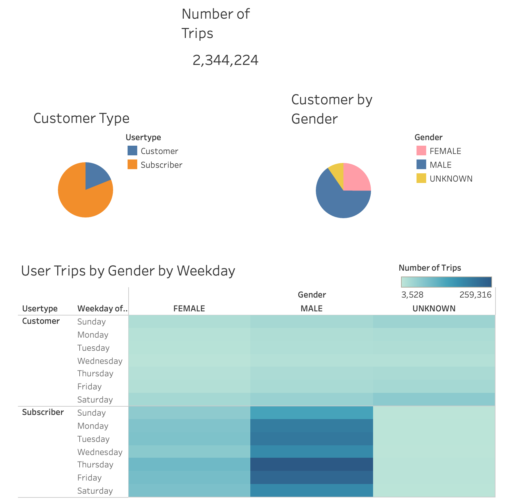

# NYC CitiBikes

## Overview 
The purpose of this analysis was to use data from CitiBike usage in New York City. The success of the program in NYC will help convince investors in Des Moines that this is a solid business proposal and the program will work for them as well.

## Results
The story I created visualizes data that represents the trip durations for all users and breaks it down by gender, the number of trips taken by day of the week for all users and by gender, and the number of bike trips for users by day of week and gender. I also included some data and visualizations from the module that show starting and ending locations for rides. With over 2 million trips taken, the success is subscription model is evident with over 80% of the rides being taken by a Subscriber. A majority of riders identify as male, with female riders only making up a quarter of riders. The highest number of trips taken are on Thursdays by male subscribers. 

|*Rider Demographics*|
|:--:|
||

The most common trip duration for riders is 5 minutes. Men riders follow that trend, with women riders spending 6 minutes. 

|*Trip Durations*|
|:--:|
||

CitiBikes are most heavily used Monday, Tuesday, and Thursday after normal work hours (5PM-7PM). The best time to perform maintenance on these bikes would be Monday mornings before 5AM. 

|*Trips by Weekday per Hour*|
|:--:|
||

|*Trips by Gender (Weekday per Hour)*|
|:--:|
||

The start and end maps are close to identical, indicating that bikes are returned within the same region they are rented from, requiring little need for bikes to be transported via van from one location to another. 

|*Top Starting & Ending Locations*|
|:--:|
||

## Summary
Using Tableau to visualize the data as a story with captions will allow the the Des Moines investors to quickly see the success of NYC CitiBikes and encourage them to implement a similar program in their cit.  

[Here's a link to the story dashboard.](https://public.tableau.com/shared/365K9KF3M?:display_count=n&:origin=viz_share_link "NYC CitiBikes")